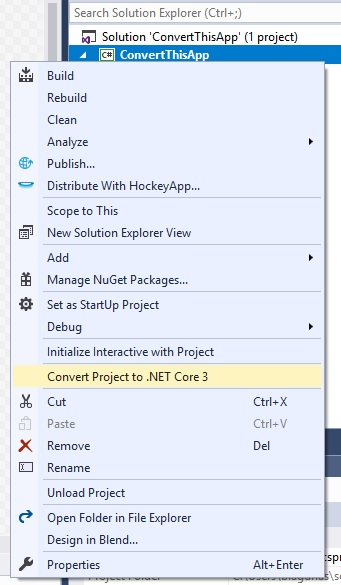

# Convert a .NET Framework Project To .NET Core 3
This Visual Studio Extension converts a WPF application built with the .NET Framework to a .NET Core 3 application.

Install the extension from the [Visual Studio Marketplace](https://marketplace.visualstudio.com/items?itemName=BrianLagunas.ConvertProjectToNETCore3)

# Usage
Simply right-click your WPF project and select the "Convert Project to .NET Core 3" option.

# Details
When you convert your application, the extension will update your CSPROJ file to the new .NET Core SDK style format.

What it keeps:
- Maintains the project version (uses AssemblyVersion)
- Maintains property groups
- Maintains all project references
- Maintains all items where the "Build Action" is Resource (everything else is removed)
- Maintains all NuGet packages (it deletes the packages.config file)
- Comments out all Assembly related attributes in the AssemblyInfo.cs file